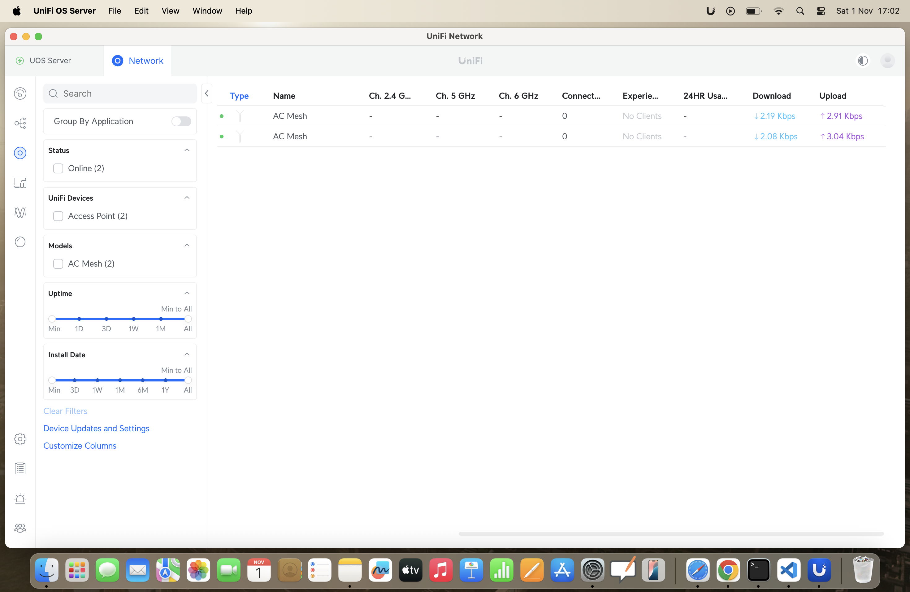
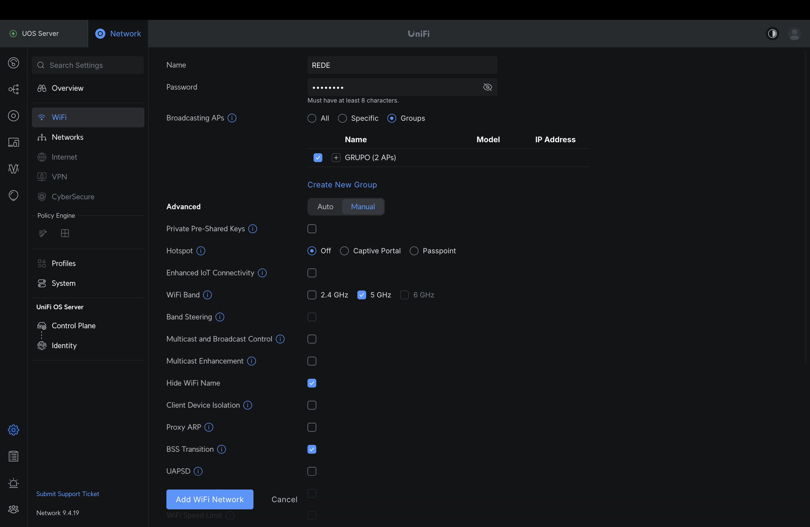
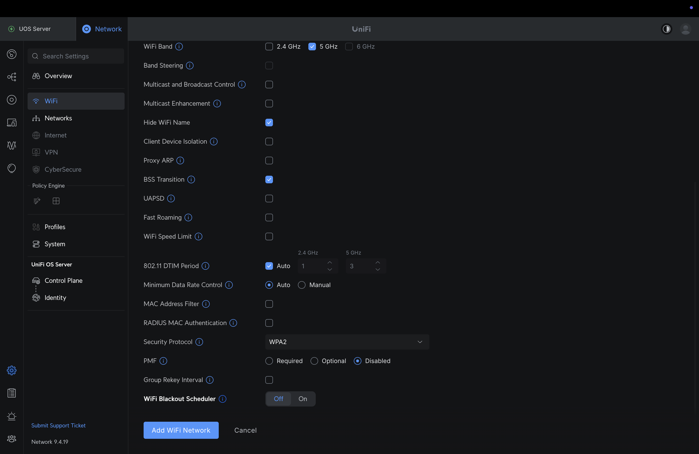

Primeiro contato com a telemetria:

MONTANDO O SISTEMA DE ANTENAS...

Elas seguem a disposição:
(1) antena laranja –> fica no carro e (2) antena preta –> fica na base/box

Como proceder →

Eixo orientador → modem: conecta todos os elementos do sistema na mesma sub-rede, por exemplo: 192.168.X.Z. Nesse caso, o X é universal para todos os componentes, permitindo a comunicação efetiva do MQTT.

MUITO IMPORTANTE: todos os componentes devem apresentar o DHCP ativado, a fim de que o modem distribua os IPs automaticamente.

Realize a conexão: cabos de internet <--> antenas

Atenção: para (2), as “antenas” são anexadas ao UAP-AC_M (bidirecional).

REINICIALIZANDO ANTENAS...

A inicialização da antena, após a conexão, é indicada pelo aparecimento de uma coloração azul-escura. Para reinicializá-la, pressione o botão reset com um objeto de espessura reduzida.
Mantenha a pressão até que a coloração comece a esbranquecer; quando isso ocorrer, você pode retirar o instrumento.
Assim que a coloração estagnar em branco, as antenas estarão prontas para serem reconfiguradas.

RECONFIGURANDO ANTENAS...
Acesse: https://unifi.ui.com → site de configuração das antenas. Crie uma conta.

https://ui.com/download -> instalador. Realize a autenticacao.

Ao ter conectado o modem ao seu pc, verifique se o IP da rede eh compativel ao exibiviel no seu computador. Caso contrario, pode haver um problema de permissao.

Na sessao UniFi Devices, 

Adote ambas as antenas no UniFi Network.

Defina qual dispositivo corresponde a cada antena e configure-os com essas caracteristicas:

1.png)

2.png)

1.png)

2.png)

Na sessao configuracoes, na subsessao WIFI, configure-o da seguinte maneira:

